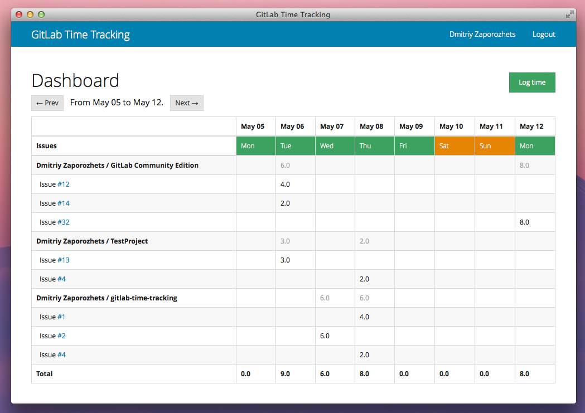

# GitLab Time Tracking

Time tracking app for GitLab 

## Requirements: 

* Ruby 1.9+
* Postgresql

## Postgresql

Postgresql database:

    # Install the database packages
    sudo apt-get install -y postgresql-9.1 postgresql-client libpq-dev

    # Login to PostgreSQL and create user/database
    sudo -u postgres psql -d template1
    template1=# CREATE USER your-username CREATEDB;
    template1=# CREATE DATABASE gtt_production OWNER your-username;
    template1=# \q

## App

Get source code

    git clone https://gitlab.com/dzaporozhets/gitlab-time-tracking.git
    cd gitlab-time-tracking  

Setup libs: 

    bundle install

Edit db ssettings:

    cp config/database.yml.postgresql config/database.yml
    vim config/database.yml

## Development

Create db tables:

    bundle exec rake db:setup

Start app on localhost:4567

    rake s

## Production 

Create db tables:

    bundle exec rake db:setup RACK_ENV=production

Create tmp and log dirs

    mkdir tmp
    mkdir tmp/sockets
    mkdir tmp/pids
    mkdir log

Start unicorn: 

    bundle exec rake unicorn:production

Install nginx:

    sudo apt-get install nginx

Setup nginx `http` section:

    # use the socket we configured in our unicorn.rb
    upstream unicorn_server {
      server unix:/path/to/app/tmp/sockets/unicorn.sock
          fail_timeout=0;
    }

    # configure the virtual host
    server {
      # replace with your domain name
      server_name my-sinatra-app.com;

      # replace this with your static Sinatra app files, root + public
      root /path/to/app/public;

      # port to listen for requests on
      listen 80;

      location / {
        try_files $uri @app;
      }

      location @app {
        proxy_set_header X-Forwarded-For $proxy_add_x_forwarded_for;
        proxy_set_header Host $http_host;
        proxy_redirect off;
        # pass to the upstream unicorn server mentioned above
        proxy_pass http://unicorn_server;
      }
    }
